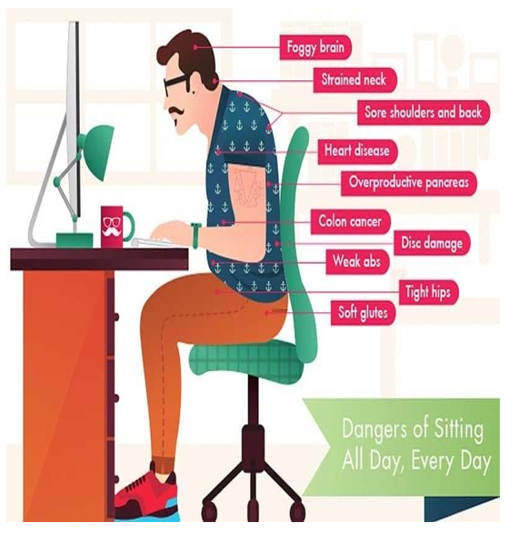

# 🪑 Empowering Comfort: Smart Chair Revolution 💺

## Description 🌟
**Empowering Comfort** is a cutting-edge **Smart Chair** designed for **health and well-being**. With integrated **sensors**, **adjustable settings**, and **advanced comfort features**, this chair takes user comfort to the next level. It tracks posture, vital signs, and provides personalized comfort by adjusting settings such as height, lumbar support, and even providing massage functions. Perfect for **home offices**, **workspaces**, or **reclining areas**, the Smart Chair ensures you stay comfortable and healthy throughout the day.

  
*Image 1: Smart Chair Overview*

## Key Features 💡
- **🧘‍♂️ Posture Monitoring**: Built-in sensors to monitor and track your posture, ensuring you maintain an ergonomic sitting position.
- **🔄 Adjustable Comfort**: Customize the height, lumbar support, and seating position for your ideal comfort level.
- **💓 Vital Sign Monitoring**: Sensors track vital signs like heart rate, body temperature, and more to help you stay aware of your health while seated.
- **💆‍♂️ Massage Functions**: Adjustable massage settings to provide relief from stress and tension during long hours of sitting.
- **📱 Mobile App Integration**: Connect to a mobile app to track health data, adjust settings, and monitor posture in real-time.
- **⚡ Energy-Efficient**: Powered with low energy consumption, ensuring sustainability and eco-friendliness.

## Technologies Used 🔧
- **Pressure Sensors**: Used to detect body pressure and provide data on posture.
- **Heart Rate and Temperature Sensors**: Monitors vital signs for health tracking.
- **Arduino**: The brain of the system that controls the chair's sensors and adjustments.
- **Motors and Actuators**: Control the height adjustment, lumbar support, and massage functions.
- **Bluetooth Module**: For mobile app integration and wireless data communication.
- **Mobile App**: Provides real-time feedback and user control of the chair's settings and features.

## Components 🛠️
- **Pressure Sensors** (for posture monitoring)
- **Heart Rate Sensor** (for health monitoring)
- **Temperature Sensor** (for body temperature tracking)
- **Arduino Uno** (for controlling the system)
- **DC Motors** (for height adjustment and lumbar support)
- **Massage Motors** (for vibration and massage functions)
- **Bluetooth Module** (for mobile app connectivity)
- **Mobile App** (for tracking and controlling settings)

## Quick Setup Guide 🚀

1. **Assemble the Components**: Connect the sensors, motors, and Bluetooth module to the Arduino board.
2. **Upload Code**: Upload the Arduino code to enable sensor reading and chair adjustments.
3. **Configure App**: Install and configure the mobile app to sync with the chair’s Bluetooth module.
4. **Position the Chair**: Place the chair in a comfortable space where it can be easily accessed.
5. **Customize Settings**: Adjust the chair’s settings for height, lumbar support, and massage features to match your comfort needs.
6. **Monitor Vital Signs**: Use the app to monitor heart rate, body temperature, and posture in real-time.

  
*Image 3: Chair Adjustment Process*

## How It Works 🧑‍💻
1. **Posture Monitoring**: The built-in **pressure sensors** detect the pressure distribution on the seat, helping to determine if the user’s posture needs adjustment.
2. **Vital Sign Tracking**: **Heart rate** and **temperature sensors** monitor your physical health while you sit, alerting you to any significant changes.
3. **Height and Lumbar Adjustment**: **DC motors** adjust the chair height and lumbar support based on user preferences for ultimate comfort.
4. **Massage Function**: **Massage motors** are activated to provide gentle vibration and massage, relieving stress and improving circulation.
5. **Mobile App Integration**: The mobile app syncs with the chair to display health data, provide posture feedback, and allow you to adjust settings from your phone.

  
*Image 4: No.of People suffering because of bad posture*

## Future Enhancements 🌱
- **💡 AI Integration**: Add AI to analyze your sitting habits and suggest ergonomic adjustments over time.
- **🧑‍⚕️ Health Analytics**: Integrate with a health analytics platform to track long-term trends in posture, health, and comfort.
- **🔋 Wireless Charging**: Implement wireless charging for devices using the chair’s power system.
- **🎶 Ambient Sound**: Add ambient sound or music features to enhance relaxation while sitting in the chair.
- **🌐 Web Integration**: Add web access for controlling and monitoring chair settings remotely.

## Conclusion 🌍
**Empowering Comfort: Smart Chair Revolution** is the future of ergonomic seating. Designed for **comfort**, **health**, and **well-being**, this chair adapts to your needs, providing a tailored seating experience. Whether you're working from home or just relaxing, the Smart Chair will ensure you're in the perfect position, with real-time health monitoring and comfort adjustments. Make sitting a pleasurable and healthy experience!

  
*Image 5: Final Working Prototype of Smart Chair*

