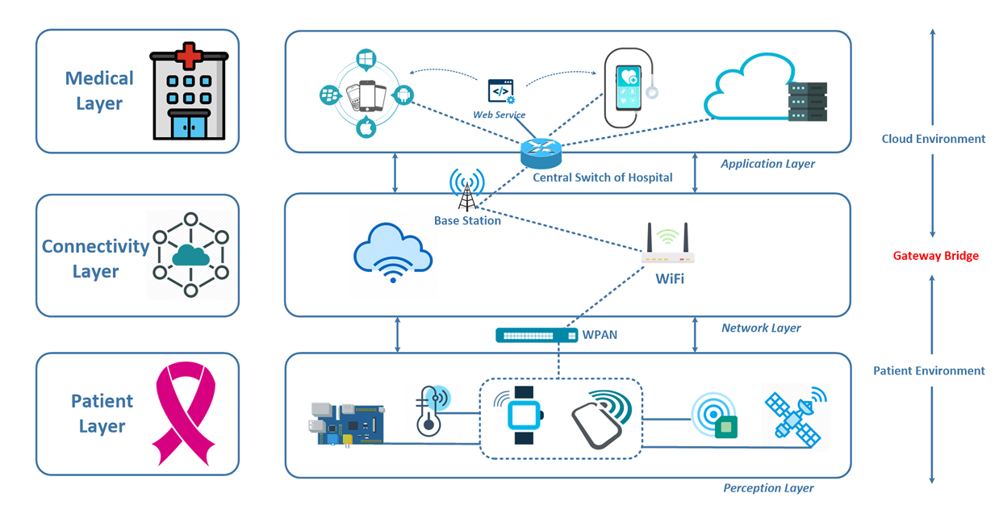
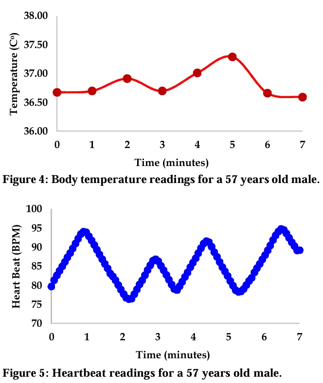

# 💖 Enhanced Cancer Care: IoT Monitoring for Patient Well-being 🩺

## Description 🌟
The **Enhanced Cancer Care: IoT Monitoring for Patient Well-being** project leverages the power of **IoT** to create a system that monitors patients’ vital signs in real-time, detecting early symptoms and improving post-treatment care. With a wearable unit and cloud integration, this system minimizes hospital visits and offers continuous health tracking, empowering both patients and healthcare providers.

  
*Image 1: IoT-based Cancer Care System*

## Key Features 💡
- **🩺 Continuous Health Monitoring**: The system constantly monitors vital parameters like heart rate, temperature, and blood oxygen levels.
- **⏳ Early Symptom Detection**: Identifies early warning signs of health deterioration, allowing for timely intervention.
- **🏥 Reduces Hospital Visits**: Patients can avoid frequent visits for check-ups by providing remote, continuous data to healthcare professionals.
- **🌐 Cloud Integration**: Data is stored in the cloud for easy access by healthcare providers for analysis and quick response.
- **📲 Real-time Alerts**: If any vital signs deviate from normal ranges, both the patient and the healthcare provider receive instant alerts.

## Technologies Used 🔧
- **Arduino**: Microcontroller used to process the signals from sensors and control the system.
- **Heart Rate Sensor**: Monitors the patient’s heart rate in real-time.
- **Temperature Sensor**: Tracks the body temperature to detect any abnormal increases or decreases.
- **Oxygen Sensor**: Measures oxygen levels in the blood to ensure adequate oxygen supply.
- **Wi-Fi Module**: Transmits the data to the cloud for storage and analysis.
- **Blynk App**: Mobile app for real-time monitoring and alerts.

  
*Image 2: Technology Stack & Sensors Used*

## Components 🛠️
- Arduino Uno
- Heart Rate Sensor
- Temperature Sensor
- Oxygen Sensor
- Wi-Fi Module (ESP8266)
- Wearable Unit (for patient)
- Cloud Platform (for data storage and analysis)
- Blynk App (for mobile monitoring)

## Quick Setup Guide 🚀

1. **Assemble the Components**: Connect the heart rate, temperature, and oxygen sensors to the Arduino.
2. **Upload Code**: Upload the program to the Arduino using the Arduino IDE to enable sensor data processing.
3. **Set Up Wi-Fi Module**: Connect the system to a Wi-Fi network to transmit patient data to the cloud.
4. **Blynk Setup**: (Optional) Connect the system to the Blynk app for remote monitoring and real-time alerts.
5. **Wearable Setup**: Attach the sensors to a wearable unit that can be worn comfortably by the patient.
6. **Power the System**: Power the system with a suitable battery or power source, and start monitoring!

## How It Works 🧑‍💻
1. The **heart rate**, **temperature**, and **oxygen sensors** continuously monitor the patient's health parameters.
2. The **Arduino** processes the data from the sensors and transmits it via the **Wi-Fi module** to the cloud platform for storage and further analysis.
3. If any vital signs fall outside the normal range, the system generates **real-time alerts** for the patient and healthcare provider.
4. Data is displayed on the **Blynk app** for mobile access, allowing both patient and doctor to monitor the situation continuously.
5. In case of any abnormal readings, timely intervention can be initiated, ensuring patient safety.

  
*Image 3: Information flow framework for cancer observation system.*

## Future Enhancements 🌱
- **AI Integration**: Implement AI algorithms to predict potential health issues based on historical data.
- **Machine Learning Models**: Train the system to learn and recognize patterns of deteriorating health, improving the system's predictive capabilities.
- **More Sensors**: Add additional sensors for monitoring more parameters, such as blood pressure or glucose levels.
- **Integration with Healthcare Systems**: Collaborate with hospitals or health apps to integrate the system for better patient care.

## Conclusion 🌍
The **Enhanced Cancer Care: IoT Monitoring for Patient Well-being** system is designed to improve patient care and reduce the burden of frequent hospital visits. By using **IoT** technology, this system provides real-time monitoring of a cancer patient’s vital signs, helping healthcare providers intervene promptly if necessary. It’s a step towards **better patient well-being**, **more personalized care**, and **early detection** of health complications.

  
*Image 4: Continuous Patient Monitoring and Alerts*

