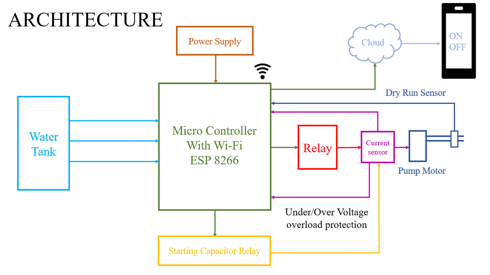
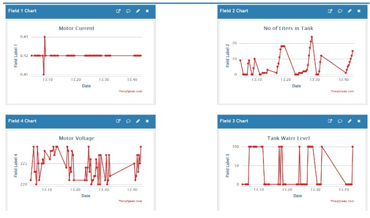
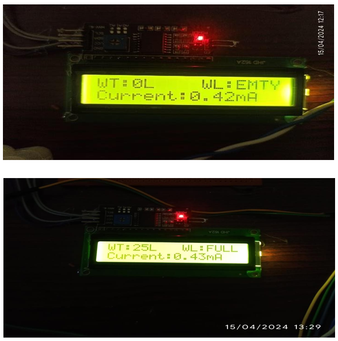
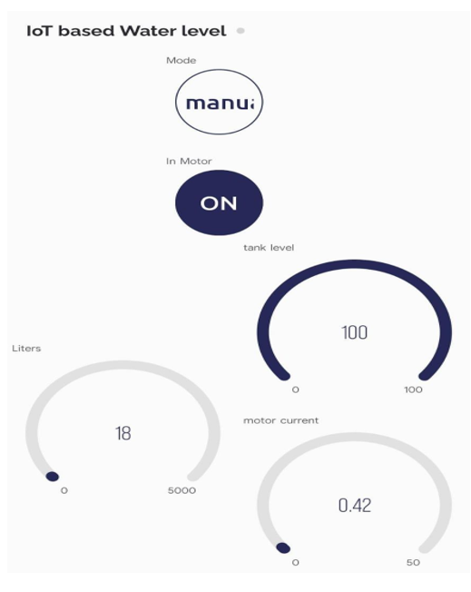

# 🌊 IoT-based Water Management System 🚰

## Description 🌟
Introducing the **IoT-based Water Management System** — a cutting-edge solution designed to revolutionize water management by integrating the power of **IoT** with smart sensors. This system ensures **real-time monitoring**, **water usage optimization**, and **leakage detection**, all while safeguarding your equipment. With Arduino at its core, it brings water management into the future!

## Key Features ⚡
- **💧 Leakage Detection**: Instantly detects and alerts you to any water leakage in the system to prevent wastage.
- **🔒 Motor Protection**: Safeguards your pump motors from damage due to overuse or malfunction.
- **📊 Water Usage Optimization**: Tracks consumption, ensuring that every drop of water is used efficiently.
- **🌍 Real-time Monitoring**: Keep an eye on your system from anywhere with live data on water levels, flow, and motor health.
- **📱 Remote Control**: Control and monitor your system effortlessly via a mobile app or a custom user interface.

## Technologies Used 🔧
- **Arduino Uno**: The heart of the system, controlling sensors and processing data.
- **Ultrasonic Sensors**: Measure water levels and detect leaks.
- **Water Flow Sensors**: Monitor the flow rate to detect irregularities in usage.
- **Relay Module**: Controls the operation of the motor, ensuring it functions safely.
- **Blynk App**: Use this app to control and monitor your system remotely via your smartphone.

## Components 🛠️
- Arduino Uno
- Ultrasonic Sensor
- Water Flow Sensor
- Relay Module
- Motor
- Wi-Fi Module (ESP8266) – For remote monitoring and control

## Quick Setup Guide 🚀 
1. **Connect** the components: Hook up the ultrasonic sensor, water flow sensor, and relay module to the Arduino board.
2. **Upload Code**: Use Arduino IDE to upload the program to your board.
3. **(Optional) Set up Blynk**: Connect your system to the Blynk app for real-time, remote control.
4. **Power Up**: Power the system using a 5V supply or battery.
5. **Start Monitoring**: Your system is now ready to track water levels, flow, and motor status in real-time.

## How It Works 🧑‍💻
- The **Ultrasonic Sensor** constantly monitors the water level in your storage tank.
- The **Water Flow Sensor** checks the water flow, alerting you to any unusual drops or leaks.
- If a leak is detected, the system immediately notifies you to take action.
- The **Relay Module** controls the motor, ensuring it's only activated when necessary, preventing damage.
- You can track and control all of this through the **Blynk App** (or your custom UI), giving you full control at your fingertips!

## Future Enhancements 🚀
- **Cloud Integration**: For long-term data storage and trend analysis.
- **AI Integration**: Predictive analysis for water consumption based on historical data.
- **Smart Home Integration**: Link with other IoT devices for a comprehensive home automation experience.

## Conclusion 🌱
The **IoT-based Water Management System** is the future of efficient water usage! With **real-time monitoring**, **automated motor protection**, and **leakage detection**, it ensures that you never waste a drop. Whether you’re managing a home, business, or industrial setup, this system offers **smart**, **sustainable**, and **cost-effective** water management.

## 🏗️ System Architecture
  
*Image 1: Overall System Architecture*  
This diagram shows the high-level architecture of the system, including sensors, the microcontroller (Arduino), and how they interact with cloud storage and mobile app monitoring.

## 📊 Storing Daily Outcomes
  
*Image 2: Storing Daily Outcomes*  
This image shows how the system collects and stores data such as water usage, leakage detection, and motor status over time for future analysis.

## 🖥️ Output Visualization
  
*Image 3: Output Visualization*  
Here, the system outputs various parameters like water flow, level, and status of the motor to a user interface, providing clear insights into the system’s performance.

## 📱 Mobile App Monitoring
  
*Image 4: Mobile App Monitoring*  
This image demonstrates how users can monitor the system remotely through the mobile app, viewing real-time data and receiving alerts on water usage, leaks, and motor status.

