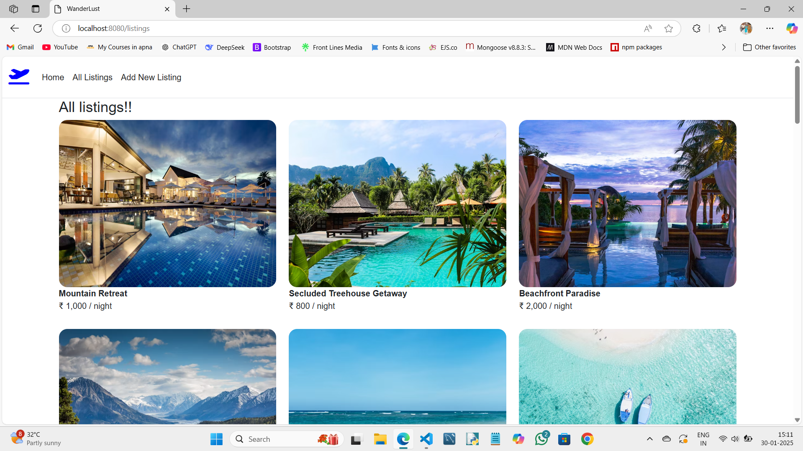

# Wanderlust: Travel Destination Manager

## Description
Wanderlust is a web-based platform designed for managing travel destinations. Users can add, update, and delete destinations (CRUD operations) while also leaving reviews, rating destinations, and maintaining a travel history. This project utilizes React.js for the front-end, Node.js for the back-end, and MongoDB for the database.

## Technologies Used
- **Frontend:** React.js
- **Backend:** Node.js, Express.js
- **Database:** MongoDB
- **Other:** Bootstrap

## Features
- Add New Destinations: Users can add their favorite travel destinations with all relevant information (location, description, etc.).
- Update Destinations: Users can edit details of existing destinations.
- Delete Destinations: Users can remove destinations from their list.
- Leave Reviews: Users can leave reviews for destinations they've visited.
- Rate Destinations: Users can rate each destination on a scale (e.g., 1-5 stars).
- Travel History: Users can track their visited destinations and maintain a history.

## Screenshots

### Homepage

### Destination List

### Review Section

### Modifying Section

