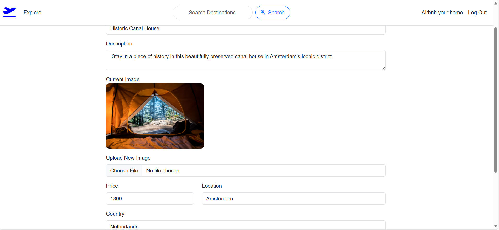

# 🌍 Wanderlust: Travel Destination Manager ✈️

**Wanderlust** is a powerful, web-based platform designed to help you manage and explore your travel destinations. With an intuitive interface, you can add, update, and delete destinations, as well as leave reviews, rate places, and track your travel history. Whether you're a travel enthusiast or just want to organize your trips, Wanderlust is the perfect tool for you.

---

## 🚀 Technologies Used

- **Frontend**: React.js
- **Backend**: Node.js, Express.js
- **Database**: MongoDB
- **Styling**: Bootstrap

---

## ⚡ Features

### 📍 Add New Destinations
- Easily add new destinations with detailed information such as location, description, and more.

### ✏️ Update Destinations
- Modify and update your favorite destinations whenever you need to.

### 🗑️ Delete Destinations
- Remove destinations from your list with just a click.

### ⭐ Leave Reviews
- Share your experiences by leaving reviews for destinations you've visited.

### 🌟 Rate Destinations
- Rate destinations on a scale from 1-5 stars to help others make better travel choices.

### 🛣️ Track Travel History
- Keep a record of all the destinations you've visited with a simple and intuitive history tracker.

---

## Screenshots

### Homepage

### Destination List

### Review Section

### Modifying Section

