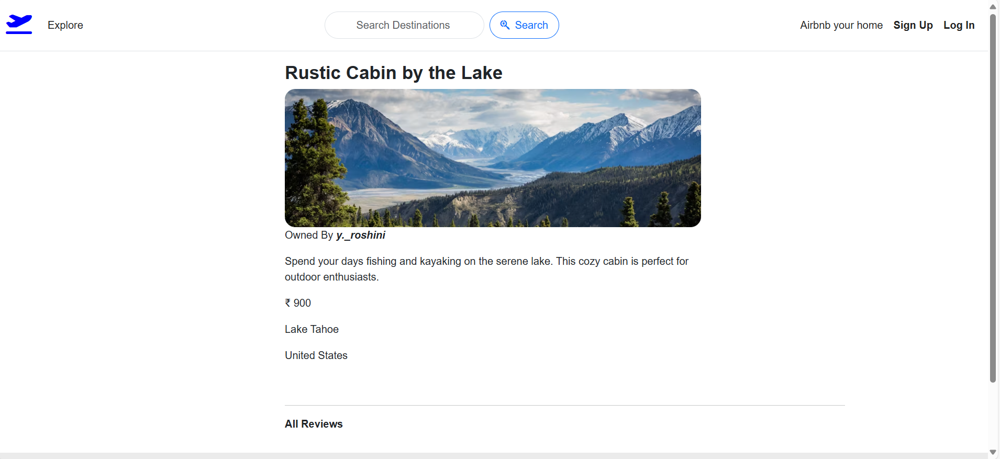
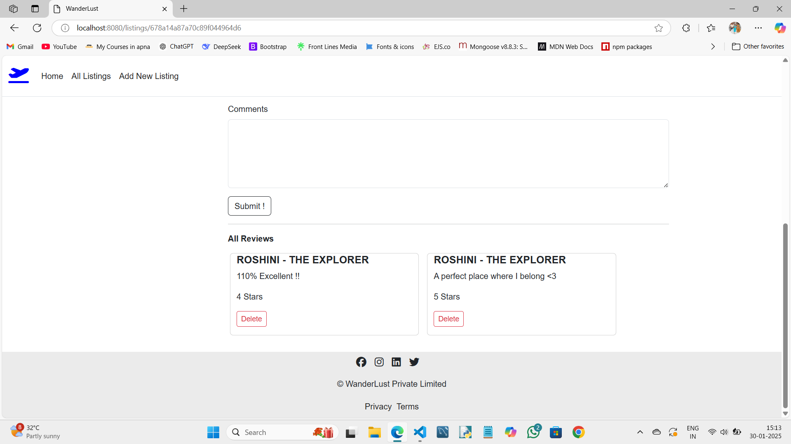

# 🌍 WanderLust - Travel Destination Manager ✈️

**WanderLust** is a web-based platform for discovering and managing travel destinations. Users can explore various listings, add new destinations, leave reviews, and interact with the platform in a seamless manner. Authentication ensures secure access to various functionalities.Whether you're a travel enthusiast or just want to organize your trips, Wanderlust is the perfect tool for you.

## Features 🚀

### General Users 🏕️ 
- 🌟 **Sign Up & Log In**: Required to access full platform features.
- 💬 **Leave & Delete Reviews**: Users can add reviews and delete their own reviews.
- 📌 **Explore Listings**: Browse various travel destinations with filters and search functionality.

### Listing Owners ✏️
- ➕ **Add New Listings**: Only logged-in users can add new listings.
- 🔄 **Edit Listings**: Owners can modify their own listings.
- ❌ **Delete Listings**: Only owners can delete their own listings.
- 🗑 **Manage Reviews**: Owners can delete reviews under their respective listings.

## 🛠 Tech Stack
- **Frontend**: HTML, CSS, JavaScript, React.js
- **Backend**: Node.js, Express.js
- **Database**: MongoDB
- **Authentication**: Passport.js / JWT

## 📸 Screenshots

### 🏠 Homepage


### 📍 Destination List


### ✍️ Modifying Section


### 💬 Review Section


### 🔐 Log In Page


##  Installation & Setup 🚀

1. **Clone the repository**
   ```sh
   git clone https://github.com/yourusername/WanderLust.git
   cd WanderLust
   ```

2. **Install dependencies**
   ```sh
   npm install
   ```

3. **Set up environment variables** (`.env` file)
   ```env
   MONGO_URI=your_mongodb_uri
   JWT_SECRET=your_secret_key
   PORT=8080
   ```

4. **Run the application**
   ```sh
   npm start
   ```

5. **Open the application**
   - Visit `http://localhost:8080` in your browser.

